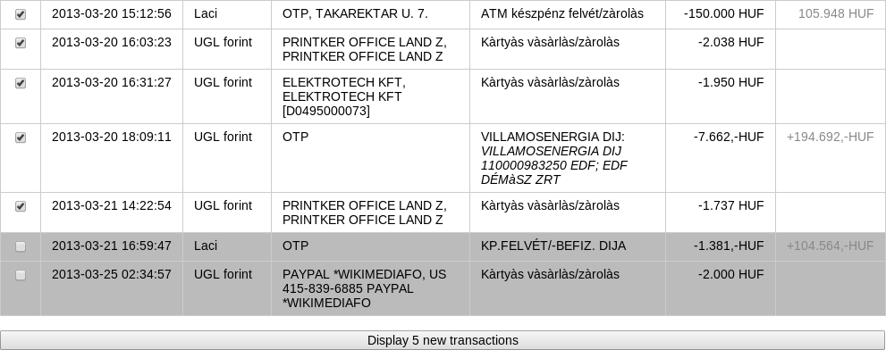

bank-sms-extractor
==================

This is a useful tool which extracts and displays your transaction records out of your SMS messages sent by Hungarian banks.  Currently only OTP bank is supported.  A checkbox feature is provided assuming that the user wants to transfer these records to a financial spreadsheet.  LocalStorage is used for persisting checkbox states.  Online/offline events and the page visibility API is used to only refresh the update button when it makes sense.

1. Install the [SMS Backup & Restore](https://play.google.com/store/apps/details?id=com.riteshsahu.SMSBackupRestore) Android app along with its [addon](https://play.google.com/store/apps/details?id=com.riteshsahu.SMSBackupRestoreNetworkAddon) then make it back up your SMS-es to your Dropbox account on a regular basis.
2. Customize `config.sh.sample` as `config.sh` and optionally `card-numbers-to-owners.php.sample` as `card-numbers-to-owners.php` and include `update-latest-sms.sh` into your crontab.  (The latter is needed because currently the archive mode of the SMS Backup & Restore app doesn't work reliably so we've got to grab the latest archive and put it into a webserver-visible directory as a fixed filename.)
3. Hit `index.php` from your web browser.

